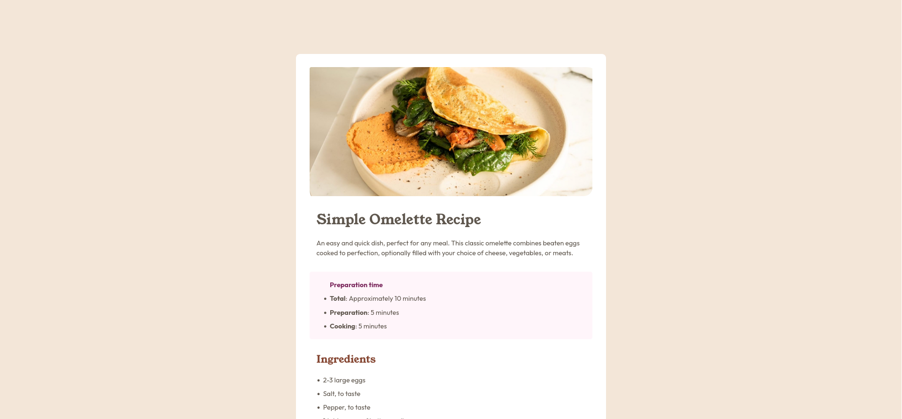

# Frontend Mentor - Recipe page solution

This is a solution to the [Recipe page challenge on Frontend Mentor](https://www.frontendmentor.io/challenges/recipe-page-KiTsR8QQKm). Frontend Mentor challenges help you improve your coding skills by building realistic projects. 

## Table of contents

- [Overview](#overview)
  - [Screenshot](#screenshot)
  - [Links](#links)
- [My process](#my-process)
  - [Built with](#built-with)
  - [What I learned](#what-i-learned)
  - [Continued development](#continued-development)
  - [Useful resources](#useful-resources)
- [Author](#author)
- [Acknowledgments](#acknowledgments)


## Overview

### Screenshot




### Links

- Solution URL: [https://github.com/vanhog/frontend-mentor-recipe-card ](https://github.com/vanhog/frontend-mentor-recipe-card)
- Live Site URL: [https://dees-frontend-mentor-recipe-card.netlify.app/](https://dees-frontend-mentor-recipe-card.netlify.app/)

## My process

### Built with

- Semantic HTML5 markup
- CSS custom properties
- Flexbox
- Mobile-first workflow


### What I learned

- Platform specific selectors
- Customize range-sliders
- Don't fear the flexbox (i.e. for good text wrapping or reordering flexboxes)
- The CSS pseudo selector ::marker [1]

```
ol li::marker{
    font-family: "Outfi"t ,Verdana, Geneva, Tahoma, sans-serif;
    font-weight: bold;
    color: var(--brown-800);
}
```

- How to control the distance between bullet point and text in lists [2]

```
ol li span {
    position: relative;
    left: 1rem;
}
```
on the following HTML

```
<li>
<span>
  <b>Cook the omelett</b>e: Once the butter is melted and
  bubbling, pour in the eggs. Tilt the pan to ensure the eggs
  evenly coat the surface.</span>
</li>
```

### Useful resources

[[1] Stackoverflow 18389224](https://jsfiddle.net/x8wru9k1/17/) How to style HTML5 range input to have different color before and after slider?

-[[2] Stackoverflow 4373046](https://stackoverflow.com/questions/4373046/css-control-space-between-bullet-and-li) CSS: Control space between bullet and <li>


## Author

- Website - [Dieter H. Hoogestraat (Dee)](https://www.hoogestraat.com)
- Frontend Mentor - [@vanhog](https://www.frontendmentor.io/profile/vanhog)


## Acknowledgments

[1] [abdigali](https://stackoverflow.com/users/12198832/abdigali) 

[2] [erjian](https://stackoverflow.com/users/140827/erjiang) 

